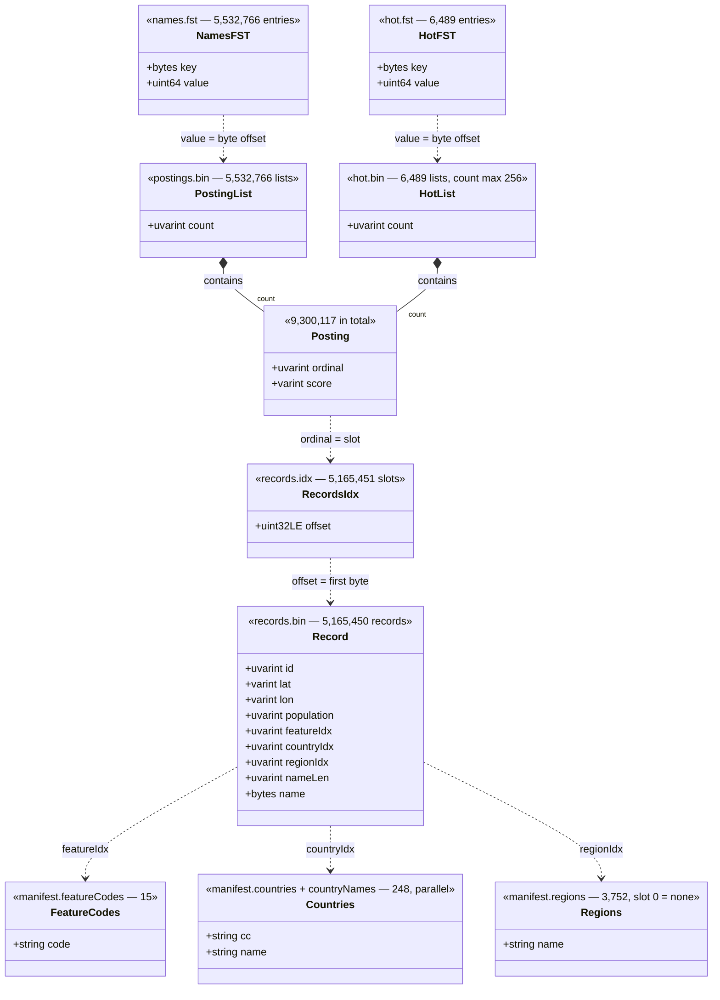

# typetown

A command-line tool that builds a finite state transducer based autocomplete
index over the populated places of the world, and queries it.

Given a prefix of a town's name it returns the locality — town, first-order
division, country — and its coordinates, so the result can be handed to
something that does proximity work.

```
$ typetown query -home US "san fr"
  San Francisco, California, United States         37.7749, -122.4194  pop 873965, PPLA2
```

## Requirements

Go 1.27 (see `.tool-versions` for the exact toolchain).

## Getting the data

```sh
make sources    # ~625 MB from download.geonames.org, fetched once
```

Four inputs are used:

| file | what it provides |
|---|---|
| `allCountries.zip` | every place; 13.5M rows, of which 5.2M are populated places |
| `alternateNamesV2.zip` | names in other languages, **with the flags that make them usable** |
| `admin1CodesASCII.txt` | `GB.ENG` → `England` |
| `countryInfo.txt` | `GB` → `United Kingdom` |

`alternateNamesV2.zip` is worth its size: the equivalent column inside
`allCountries.txt` is a lossy copy with the language codes and the
`isColloquial` / `isHistoric` / `isPreferredName` flags stripped out. Without
them, "New York Van Java" is an alternate name of Jakarta and outranks New York
City for the query `new y`.

## Build

```sh
make build                  # -> bin/typetown
typetown build              # -> ./index, from ./sources
typetown build -countries GB -out index-gb        # a fast subset for development
typetown build -min-population 1000               # smaller index, fewer hamlets
```

## Query

```sh
typetown query lond                    # one shot
typetown query -home US -limit 5 york  # bias toward a country
typetown query -json edinburgh         # machine-readable
typetown query -i -home US             # interactive
```

### Interactive

`-i` on a terminal searches incrementally: results are redrawn on every
keystroke, `↑`/`↓` move the selection, `enter` accepts it and `esc` quits.
`ctrl-w` deletes a word, `ctrl-u` clears the line.

The redraw goes to stderr and the accepted result to stdout, so the selection
can be captured:

```sh
read -r town lat lon <<<"$(typetown query -i -home US)"
```

When stdin is not a terminal there are no keystrokes to react to, so `-i` falls
back to reading whole lines.

## Benchmark

`bench` measures latency, and accuracy too when the query set says what each
query should return. A query set is one case per line:

```
<query>
<query>	<expected geonameid>
<query>	<expected geonameid>	<weight>
```

```sh
typetown bench                                     # built-in sample, latency only
typetown bench -queries set.tsv -home US           # latency and accuracy
typetown bench -queries set.tsv -prefixes 3,4,5    # accuracy as a user types
```

## How it ranks

Every match is scored `prominence − classPenalty`, both fixed at build time so
posting lists can be written pre-sorted and a query is a merge rather than a
scan.

**Prominence** combines three signals, in descending order of how often they are
actually present:

- **script diversity** — how many writing systems name the place. Present for
  34% of places, and unlike a raw count of alternate names it is not fooled by
  transliteration variance.
- **feature code** — GeoNames' own statement of administrative rank: a national
  capital outranks a county seat outranks a village.
- **population** — the obvious signal, but it is zero for about 91% of populated
  places, so it cannot carry the ranking alone.

**Class penalty** demotes matches reached through a lesser name — an official
alternate, an ordinary alternate, a historic name. The penalties are bounded on
purpose: a hard tier would bury Mumbai for the query `bombay`, while no penalty
at all lets a large city hijack an unrelated prefix.

Two adjustments happen at query time, because they depend on the caller rather
than the data: an exact-match bonus, and an optional bias toward a home country.
They are applied as a bounded re-rank over a pool of candidates pulled from the
merge.

### Hot prefixes

A short prefix has an enormous number of keys beneath it — `p` covers 333,538 —
which is far too many to walk on every keystroke. Truncating the walk is not an
answer, because the FST yields keys alphabetically: a cap silently ranks by
spelling, and `p` returns Pa Sang, Thailand instead of Paris.

Nearly all of that cost sits in a few thousand prefixes, so the build
precomputes a ranked shortlist for every prefix with at least 500 keys beneath
it — about 6,500 of them, 8 MB — and scans everything else exhaustively, which
is cheap precisely because it is not hot.

### Memory

Index files are mapped read-only (`PROT_READ`, `MAP_SHARED`) rather than read
onto the heap. Replicas sharing a volume then share one copy of the index in the
host page cache no matter how many run, those pages are reclaimable under memory
pressure instead of triggering an OOM kill, and the Go collector never has to
size a heap around hundreds of megabytes it can never free. A single query
process holds about 7 MB resident against a 266 MB index.

The trade is that a mapping is a live view, not a snapshot: **replace an index by
building into a new directory and swapping, never by overwriting files a reader
may still hold open.** `OpenOptions{NoMmap: true}` reads instead, for callers who
would rather have the snapshot.

## The index on disk

Seven files. A filled diamond means one structure contains the other; a dashed
arrow is a pointer — a number stored in one file that addresses another. Every
hop below is one of those numbers, so a query resolves by arithmetic rather than
by scanning.



`names.fst` is walked for every query. `hot.fst` short-circuits the prefixes with
too many keys beneath them to walk on a keystroke; both paths converge on record
ordinals. Repeated strings — country, region, feature code — live once in
`manifest.json` and are referenced by position, so "United Kingdom" is not
written 250,000 times.

`records.idx` exists because a record is variable-length: eight of its nine
fields are varints, so there is no arithmetic path from an ordinal to a byte
offset. Its extra trailing slot holds the file's length, which lets record `i`
span `[offset[i], offset[i+1])` with no special case for the last one.

## Layout

```
cmd/typetown/       thin main(): wires stdio into the CLI and exits
internal/cli/       flag parsing, subcommand registry, usage
internal/geonames/  parsing the dumps; name folding; script counting
internal/index/     the on-disk format, the builder, and search
```

## Development

```sh
make test   # go test ./...
make lint   # go vet ./...
make tidy   # go mod tidy
```
